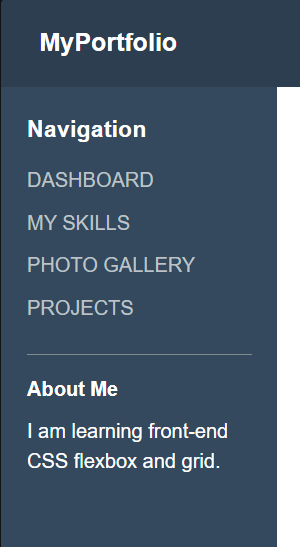
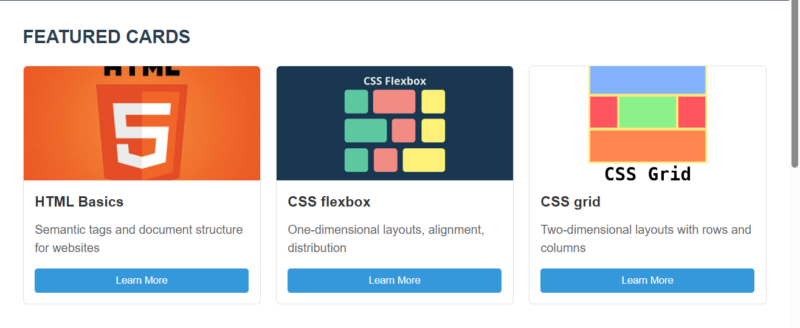
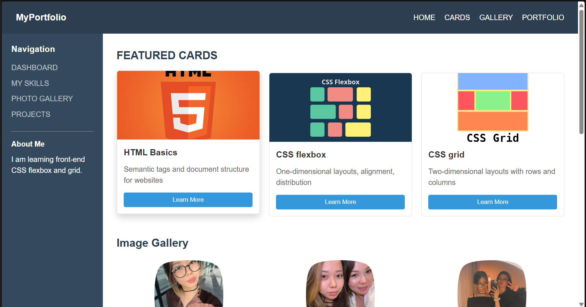
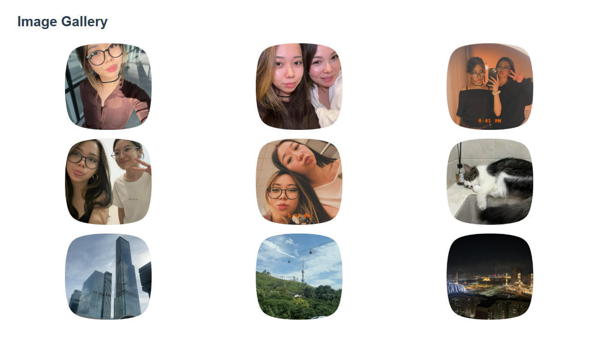
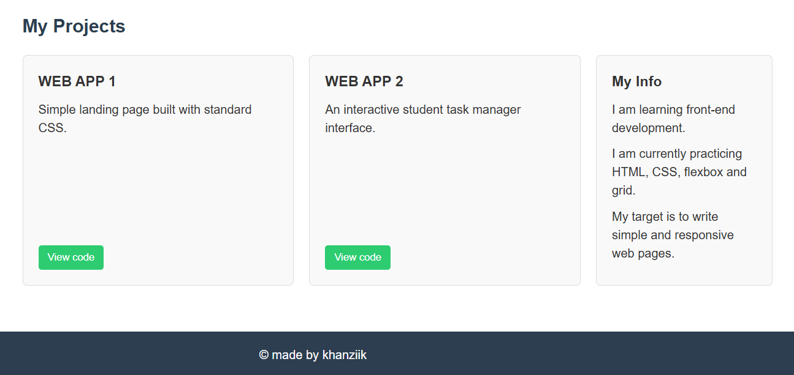

# Assignment 2 - Student Portfolio

## Student Information
* **Name:** Suleimen Khanzere
* **Group:** IT-2504
---

## Assignment Tasks & Implementation
### Task 0: Navigation Bar
* Implemented using Flexbox (`display: flex`, `justify-content: space-between`, `align-items: center`).
* Features a left-aligned logo ("MyPortfolio") and right-aligned navigation links (`HOME`, `CARDS`, `GALLERY`, `PORTFOLIO`).

### Task 1: Featured Cards Row
* Built using Flexbox (`display: flex`, `flex: 1`) to ensure three cards sit in a single row and stretch to an equal height.
* Includes images, title, description, and button elements with a hover effect (`transform: translateY(-5px)`).

### Task 2: Page Layout with Grid Areas
* Built the overall website layout using CSS Grid (`.page-container`) with `grid-template-areas` arranging the header, sidebar, main content, and footer into distinct zones.

### Task 3: Image Gallery
* Implemented a 3-column grid (`grid-template-columns: repeat(3, 1fr)`) containing 9 images.
* Each image item features a hover overlay with a caption using absolute positioning and `opacity` transition.

### Task 4: Portfolio Page & Responsiveness
* Combined Flexbox and Grid layouts to create a portfolio section with project cards and an info sidebar.
* Added a responsive media query (`@media (max-width: 768px)`) to adapt the layout for mobile screens.

---

## Screenshots

### Task 0: Navigation Bar

### Task 1: Featured Cards

### Task 2: Page Layout

### Task 3: Image Gallery

### Task 4: Portfolio Page

---
## Work Process Summary
1. Designed the structural layout using CSS Grid areas (`grid-template-areas`) for the page shell.
2. Built the header and card rows using Flexbox for alignment and equal heights.
3. Created the 3x3 image gallery grid with hover overlay effects.
4. Added the portfolio section and configured mobile responsiveness using media queries (`@media (max-width: 768px)`).
5. Tested the website locally in the browser and finalized the repository structure.